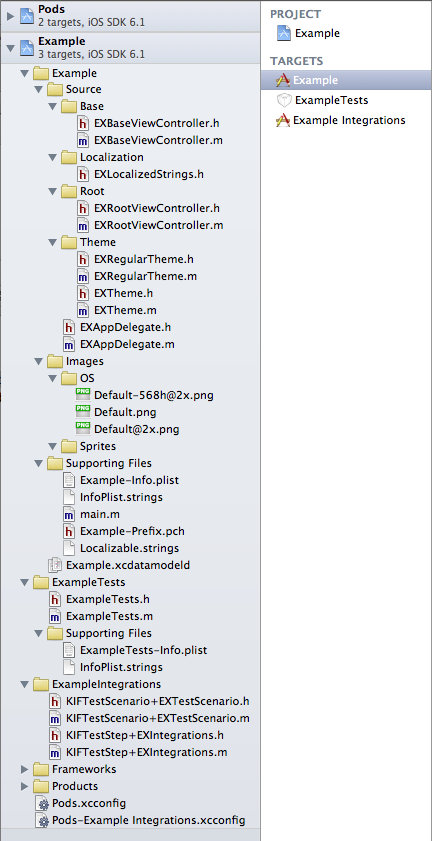

#An Xcode Project Template for iOS
This repository contains an Xcode Project Template for new iOS apps (currently set to ios 5.1 by default), including a default set of libraries (installed via the CocoaPods project), Apple-esque theming stubs and a folder structure suited for small and large projects alike. The template is compatible with Xcode 4.6.

##How to get started
1. Make sure you have [CocoaPods](https://github.com/CocoaPods/CocoaPods) installed.
1. Clone this repository into a location of your choosing, like your projects folder.
2. Create a symbolic link from the enclosed directory 'template' to your library's project templates folder in the terminal: 

	`ln -s '/Users/*USER*/*path-to-repository*/Project-Template-iOS/template' '/Users/*USER*/Library/Developer/Xcode/Templates/Application/Project Templates/Application by epologee'`
	
	Note: substitute the `*USER*` parts with your own username and check that the path to the template folder is correct. Type `pwd` into the terminal if you're unsure, *do not use the tilde (`~`)*. The last part of the library path will show up in Xcode as the name of the template, in this case 'Application by epologee'.
3. Create a new Xcode project and choose the 'Application' icon in the 'Application by epologee' section. Fill out the necessaries, pick whether you want Core Data included and don't forget to enter a nice and catchy class prefix.
4. Close the project after Xcode finishes its creation, then go to the terminal and `cd` to your new project folder. Type `pod install` and watch CocoaPods perform magic.
5. Open the .xcworkspace file from the Finder and hit Xcode's 'run' button.
6. Create awesome apps.

##Source/AppDelegate.h & .m
Unlike Apple's default project setup, I have a preference for putting all Objective-C code in subfolders of a `Source` folder. All .h and .m files in this template are in (a subfolder of) that Source folder, but in the .xctemplate plists I couldn't find a way to completely mirror the folder structure in Xcode groups. After step 4. in the 'How to get started' list above, I delete the `Source`-group and the AppDelegate.h/.m-files manually, to then drag the `Source` folder the from Finder back into the project. That way the Xcode groups mimic the folder structures, all classes are where they belong and the Xcode groups are linked to their folder counterparts.

##Theming
The \*Theme classes in the project template are based on the WWDC 2012 presentation 'Advanced Appearance Customization on iOS' ([session 216](https://developer.apple.com/videos/wwdc/2012/?id=216)). I'd highly recommend watching that video, especially the last 20 minutes, where the speakers explain how they approached theming the 'Find My Friends' app.

##.gitkeep
When using git as your versioning control system, it is impossible to add empty folders to the git repository. The .gitkeep files (gitkeep without the dot '.' in the xctemplate directories) you find in the project are there to force git to add the containing directories to the project. You can remove the .gitkeep files from the Xcode project anytime after step 3. See [this StackOverflow post](http://stackoverflow.com/a/7229996/432782) for more information.

##KIF integration testing
The template contains a first few steps towards out-of-the-box support for [Square's KIF integration testing framework](https://github.com/square/KIF). One of the necessities for KIF is that you have a second target next to your actual app target. I haven't yet figured out how to achieve this automatically, so it requires you to perform some manual steps after creating the project.

You need to manually duplicate your main target, suffix it with ' Integrations' (mind the leading space). Go into the new target's build settings and determine a new value for PRODUCT_NAME (it defaults to something that ends on ' copy') and have the Info.plist file property point to the original plist of your application.
			
When all this is done, run 'pod install' or 'pod update' and your integration testing is ready to go.
I have a [Stack Overflow question](http://stackoverflow.com/q/14651166/432782) going to get to the bottom of automating this, but for now a little handiwork is involved.

##Core Data support with mogenerator
Apple's original implementation of the Core Data stack served fine for example projects, tutorials and the likes, but in my opinion the app delegate is not the place to contain this much knowledge about Core Data. If you enable Core Data when creating projects with this template, you'll get one `__CoreDataProxy` class that extends the `AbstractCoreDataProxy` class from the [TwelveTwentyToolkit/CoreData framework](https://github.com/TwelveTwenty/TwelveTwentyToolkit-ObjC/tree/master/TwelveTwentyToolkit/CoreData). It also adds a `generate_classes.sh` shell script to the project's root folder, that uses [mogenerator](http://rentzsch.github.com/mogenerator) to generate your Core Data entity classes. Call this from the terminal after you add a few entities with the Core Data model tool:

    sh generate_classes.sh